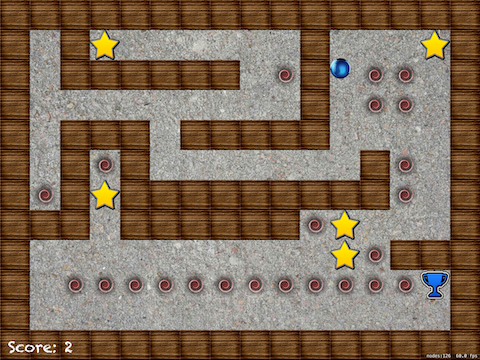

# Marble Maze (SpriteKit)

## Description
Respond to device tilting by steering a ball around a vortex maze.

### Steps to clean a new SpriteKit project.
* On `GameScene.sks`
  * Delete the **Hello World `Node`**
  * On `attributes inspector` from `GameScene.sks`:
    * Change the `anchor point` for **`X`:0 `Y`:0**.
    * Change the size for **W:1024** **H:768** to match iPad `landscape` size.
        > Although there are iPads much bigger, `SpriteKit` takes care of it, so don't worry about this size.
* Delete `Actions.sks`, move it to trash.
* On `GameScene.swift`
  * Delete the two properties
  * Delete all the code inside `didMove(to:)`
  * Delete the other methods

## Tags
The application was created in step-by-step, so if you want to look through each part, here are some tags that goes through the developing path.

### loading-a-level
| Screenshot 01 |
| ------------- |
|  |

### tilt-to-move
| Screenshot 02 |
| ------------- |
|  |

### contacting-but-not-coliding
| Screenshot 03 | Screenshot 04 |
| ------------- | ------------- |
|  |  |